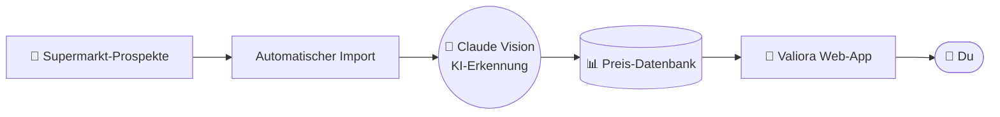

# 🛒 Valiora

### Supermarkt-Preise in Österreich — endlich transparent.

*Valiora erfasst die Rabattaktionen aller großen Supermärkte automatisch per KI
und zeigt mit echter Preis-Historie, wann ein Angebot wirklich günstig ist.*

 

---

## Das Problem

Lebensmittelpreise ändern sich ständig — verteilt auf dutzende Prospekt-PDFs, die
niemand durchblättern will. Niemand sieht den Verlauf. Und kaum jemand weiß, ob ein
beworbenes Angebot **wirklich** günstig ist oder nur so aussieht.

## Die Idee

Valiora sammelt die Aktionen aller großen Supermärkte automatisch ein, macht sie
vergleichbar und beantwortet die eine Frage, die zählt:

> **Wo ist mein Einkauf gerade am günstigsten?**

🟢 **Integriert:** BILLA · BILLA Plus · SPAR  
🟡 **Geplant:** Hofer · Lidl · Penny

---

## ✨ Was Valiora kann

| | Feature | |
|:--:|---|---|
| 🤖 | **KI-Aktionserfassung** | Rabattaktionen aller großen Supermärkte werden automatisch eingelesen und vergleichbar gemacht — ohne Prospekt-Blättern. |
| 🧺 | **Smart Cart** | Einkaufsliste eingeben — Valiora findet automatisch die günstigste Kombination über alle Märkte. |
| 📈 | **Preis-Historie** | Für jedes Produkt entsteht ein Preisverlauf wie ein Kurschart. So erkennt jede:r auf einen Blick, ob ein Angebot wirklich gut ist. |
| 🔔 | **Preisalarme** | Wunschpreis festlegen — für ein Produkt oder eine ganze Kategorie. Valiora benachrichtigt dich, sobald er erreicht ist. |
| 🔍 | **Aktionen vergleichen** | Alle aktuellen Deals auf einen Blick, gefiltert nach Produkt, Kategorie oder Supermarkt. |

---

## 🚀 Status & Vision

Der **Prototyp steht** — Datenpipeline, Preis-Historie und Smart Cart laufen.
Unser Ziel: die transparenteste Preisplattform für den österreichischen
Lebensmittelhandel — ein „Geizhals für den Supermarkt".

> ### 🤝 Wir suchen Investor:innen & Kooperationspartner.
>
> Du arbeitest im Handel, in der Lebensmittelbranche oder investierst in junge
> Tech-Produkte aus Österreich? Dann lass uns reden.
>
> **→ [valiora.at](https://valiora.at)**

---

## 🧠 Unter der Haube

Vollautomatisch, von der Prospekt-Seite bis zum Preisverlauf:

KI liest jedes Produkt und jeden Preis aus den Prospekten — die Preis-Mathematik
selbst bleibt aber immer **exakt und nachvollziehbar**, nie geschätzt.

Gebaut mit Python · FastAPI · Next.js · PostgreSQL · Anthropic Claude Vision · Azure

---

## 👥 Das Team

Ein Diplomprojekt von drei Schülern der **HTL Villach**:

- **Paul Gradischnig** ([@gradiscp](https://github.com/gradiscp)) — Backend, KI-Integration, Daten, Deployment
- **David Gredler** — Frontend, Qualitätsmanagement
- **Thomas Mairer** — Scraper, KI-Integration

---

**Schlau einkaufen beginnt mit transparenten Preisen.**

[🌐 valiora.at](https://valiora.at)

